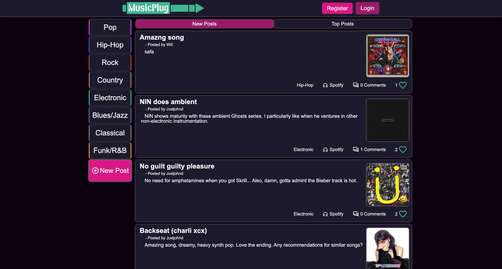

# Yakumon Frontend

Click the image if you wish to visit the site.

---

A music-recommendation social media platform to help people share their favorite songs with others and discover new music. Utilizes the Spotify API with OAuth2.0 authentication for user info, music search, and sharing. Has a full user, post, comment CRUD backend with strong pagination in React on the front.

The focus of this app is discovery through the default of the app displaying new posts first and sorting by genre.

## Technologies

- React
- Spotify API
- Styled-Components
- React-DOM/React-Router-DOM

### Features

- User interface is quick and easy to navigate.
- Mobile-first styling and feature implementation.
- Very flexible CRUD front-end with user, post, comment models.
- Styled-Components offers the ability for diverse theming and great flexibility in usable styled components across the entire app.

### Challenges Faced

#### - Spotify API

MusicPlug users sign up through a third-party verification process with Spotify by their OAuth2.0 authentication system. Once they verify through Spotify, users can create an account on Musicplug--info from Spotify is used to ease the process through auto-fill email and username. From there, users can quickly and easily search up their favorite songs through Spotify's search API and share it with others.

_As of this writing, the Spotify API works for users that I have specifically whitelisted due to their limitation of connected users. This may change suddenly due to Spotify's quick policy change habit._

#### - Search Functionality

When a user wishes to create a new post, flexible functionality is in place to allow users to search by artists, albums, and songs. But further, the app automatically searches for the a selected artist's albums, or that album's song list to speed the process. The user, of course, can delete any choices and choose to search directly by song or album or artist as they wish.

#### - Pagination and Sorting

Musicplug displays a strong pagination suite with new post and populat post sorting, genre sorting, and page by page sorting between the choices. This is made possible with the powerful backend pagination and a custom page and genre sorting on the frontend.

#### - Styled-Components Theming

On top of styled-component's global variable theming, Musicplug offers light and dark theming which is saved to localstorage to retain the user's preferences.

#### - CRUD Applications

MusicPlug offers full social media CRUD applications:

- User create/update/delete
- Post create/update/read/delete
- Comment create/update/read/delete
- Post like/dislike create/read/update
